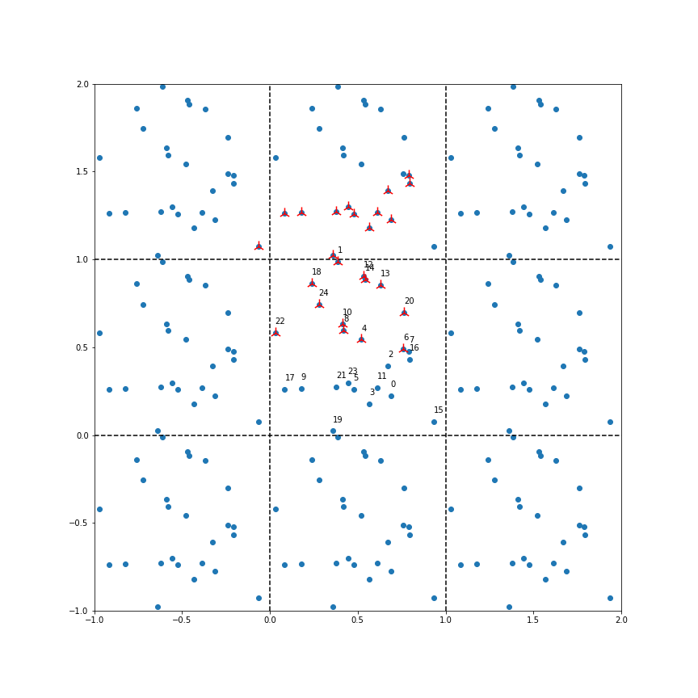

# Weekly progress journal

## Instructions

In this journal you will document your progress of the project, making use of the weekly milestones.

Every week you should

1. write down **on the day of the lecture** a short plan (bullet list is sufficient) of how you want to
   reach the weekly milestones. Think about how to distribute work in the group,
   what pieces of code functionality need to be implemented.
2. write about your progress **until Monday, 23:59** before the next lecture with respect to the milestones.
   Substantiate your progress with links to code, pictures or test results. Reflect on the
   relation to your original plan.

We will give feedback on your progress on Tuesday before the following lecture. Consult the
[grading scheme](https://computationalphysics.quantumtinkerer.tudelft.nl/proj1-moldyn-grading/)
for details how the journal enters your grade.

Note that the file format of the journal is *markdown*. This is a flexible and easy method of
converting text to HTML.
Documentation of the syntax of markdown can be found
[here](https://docs.gitlab.com/ee/user/markdown.html#gfm-extends-standard-markdown).
You will find how to include [links](https://docs.gitlab.com/ee/user/markdown.html#links) and
[images](https://docs.gitlab.com/ee/user/markdown.html#images) particularly
useful.

## Week 1
The planning (Wednesday part):
The task for this week are the following:
1. Develop a way to store each particle's velocity and position at every timestep
2. Calculate the force on each particle using the Lennard-Jones potential
3. Implement the Euler method for time evolution
4. Implement the periodic boundary condition
5. Define a function that calculates the total energy of the system
~6. Make sure that you commit your code regularly to Gitlab.

We realise that step 1 needs to be completed first as all further code will be dictated by the way we implement the storing of position and velocity.
The most work will be in implementing points 2 and 4, both these points can be worked on separately after which tasks 3 and 5 can be completed.

####Task division at time of planning
| Task | Description | Who |
| ---          | ---      | ---          |
| task 1 | Storing space and speed        | Marc        |
| task 2 | Calculation of force           | Jeroen        |
| task 3 | Euler method for time          | Age       |
| task 4 | Periodic Boundary conditions   | Age        |
| task 5 | Total energy                   | Marc        |
| task 6 | git commit(s)                  | Age, Marc, Jeroen        |

task 1:
created vrmatrices.py
contains three functions
1. init_rv_uniform: function generates two 2D matrix for the initial position and velocity vectors of a M dimentional system with N particles. The elements are generated randomly with a continuous uniform distribution. ----- Note: It is possible an new function has to be created with with a different random distribution.
2. gen_rv_matrix: function generates two 3D matrix intended to be used to store the initial and calculated position and velocity vectors.
3. store_rv: function to store the inital and calculated position and velocity vectors in a 3D matrices.

task 2:
Created a function compute_force that computes the force �� between two particles. This function is used in get_forces that iterates over all the particles an creates an array of cumulative forces on each particle.

task 3/4:
Added a function Euler_integrate to sim_toolkit.py. Function Takes in the initial conditions of the system and returns the evolutions of the positions and velocities of each particle over time. (With periodic boundary conditions included)
Created a Test file, Integration test, to see if the integration results seem reasonable.

task 6:
Created Energy_calc.py
Created two functions, the fist calculates the kinetic energy of each particle in an N particle system. The second function calculates to potential energy of a two particle system.
Notes:
- The mass of the particles is not taken into account when determining the kinetic energy.
- The potential energy is only determined for a two particle system
- Potential check to perform when analyzing the performance of the script is to determine the total energy of the system at each time step (as energy must be conserved).

Progress animation of first week:
[animation of argon](figs/animation.gif)

## Week 2
(due 21 February 2022, 23:59)
Tasks for this week
1. Derive the expression of the kinetic energy in dimensionless units
2. Change your existing molecular dynamics simulation to now use dimensionless units
   maybe we want to do this in a separate file? Or have a convention for how we denote a function that uses and yields natural units.
3. Implement the minimal image convention
4. Simulate 2 atoms in 3D space. Choose their initial positions close to the boundary. This way, you can clearly see if the periodic boundary conditions work. Plot their inter-atom distance over time. Furthermore, also plot the kinetic and potential energy, as well as their sum, over time.

Task 1:
Inserting the the derived natural units from the lecture for time, position and energy which were
$`t = \sqrt{\frac{m \cdot \sigma^2}{\epsilon}} \cdot T `$,
$`r = \sigma \cdot R `$ and
$`U = \epsilon \cdot E`$
respectively into the equation for the kinetic energy, i.e.
$` U_k = 1/2 \cdot m  v^2 = 1/2  m \cdot {dr/dt}^2 `$,
gives
$` E_k = 1/2 \cdot (dR/dT)^2 `$

Task 2:
Non-dimensionilization was implemented by removal of sigma and epsilon in the equation of the Lennard-Jones potential, and removal of the mass from Newton's equation. Consideration of the timesteps and box size is necessary such that the particles do not move too far per timestep and the average initial distances are of the order of the natural unit of distance (sigma). As such a box size of the order of the cube root of the number of particles is needed and the order of the timesteps should be of 10^-2 - 10^-3.

Task 3:
Implemented a function that looks for the closest image particles around a given particle and returns a look up array that can be easily used in previous code. Proof of work below. In the example the program function indicated all particles that could be images that are closest to particle '1' near the border of the major-y normal x box.

Task 4:
Simulation of 2 particles in 3D space was performed in the simulate.ipynb file. Using a box of size 3 and fixed initial postions at x=1,y=1,z=0 and x=2,y=2,z=0. Box size was chosen to ensure the distance between the particles is large enough such that the force on the particles does not explode and result in the unphysical movements. .

As expected we see oscillating behaviour in the kinetic and potential energy, as E_pot is high E_kin is low and vice versa.

Plotting the the sum of the energies reveals however that the total energy keeps increasing stepwise as the two particles come close to one another, something which should not be happening.

As was mentioned in the feedback, moved the functions to the skeleton.py file and create a simulate file to do simulation, in order to better keep track of relevant coding.

## Week 3
(due 28 February 2022, 23:59)
Tasks for this week:
1.Extend your code to more than 2 particles.
2.Implement the velocity-Verlet algorithm.
3.Investigate the conservation of energy in the system. Plot the evolution of the kinetic and potential energy, as well as their sum.
4.Compare the results of energy conservation using the Euler and Verlet algorithms.
5.Make an initial attempt to structure your code properly. You can start from the example structure we included in your repository.

Task 1:
Most of the code could already take inputs with more than 2 particles, only the energy functions had to be adjusted to allow for more than 2 particles.

Task 2:
The velocity-Verlet algorithm was implemented as Verlet_integrate_images in the skeleton.py file.

Task 3:
plots were made of the time evolution of the kinetic and potential energy of a two particle system using the newly implemented algorithm.

Task 4:
We can compare this to the energy evolution when using Eueler's method.

We see that using the VV algorithm the potential energy and kinetic energy periodicaly fluctuate and don't blow up like in the simulations using the Euler algorithm. As a result when we look at the total energy of the system it does appear to be preserved now (fluctuating with an order which is a lot smaller than the order of the enrgy itslef) , while the enrgy in the Euler simulation keeps increasing.

Task 5:
Several changed were made to functions in the skeleton.py file to improve performance (changing for loops), and help with the structure of the code.

## Week 4
(due 7 March 2022, 23:59)

The distribution does indeed follow a gaussian

Positioning of the FCC lattice and evolution:

The rescaling of the velocities to ideal temperature:

We were looking at the pair correlation function:

## Week 5
(due 14 March 2022, 23:59)

We first calculated the specific heat of the system of 108 particles in dimensionless units.

Plotting the autocorrelation function $` \chi_{C_v}(n)`$ show us the oscillations we were warned about.

So zooming in to $`0 \leq n \leq 50`$ timesteps and fitting the exponential we get an autocorrelation time $`\tau \approx 12.73`$ dimensionless timesteps

Using the autocorrelation time to calculate the error, we get a specific heat in dimensionless units of:
$`C_v = 9.34\cdot 10^{-3} \pm 3.36\cdot 10^{-12}`$

We plan to do simulations for the pair correlation function and the specific heat in the report.

Code is able to handle both 2D and 3D simulations. With up to 300 particles for about 400 timesteps within 5 minutes.
We see this as sufficient since for high particle counts the atoms are already sufficiently trapped in a lattice.
